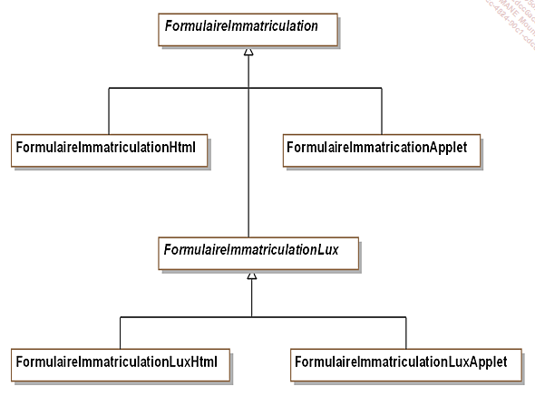

# Contexte

Pour effectuer une demande d’immatriculation d’un véhicule d’occasion, il convient de préciser sur cette demande certaines informations importantes comme le numéro de la plaque existante. Le système affiche un formulaire pour demander ces informations.

Il existe deux implantations des formulaires :

les formulaires HTML

les formulaires basés sur une applet

Il est donc possible d’introduire une classe abstraite FormulaireImmatriculation et deux sous-classes concrètes FormulaireImmatriculationHtml et FormulaireImmatriculationApplet.

Dans un premier temps, les demandes d’immatriculation ne concernaient que la France. Par la suite, il est devenu nécessaire d’introduire une nouvelle sous-classe de FormulaireImmatriculation correspondant aux demandes d’immatriculation au Luxembourg, sous-classe appelée FormulaireImmatriculationLux. Cette sous-classe doit également être abstraite et avoir également deux sous-classes concrètes pour chaque implantation.

Cette organisation met en avant deux problèmes :

La hiérarchie mélange au même niveau des sous-classes d’implantation et une sous-classe de représentation : FormulaireImmatriculationLux. De plus pour chaque classe de représentation, il faut introduire deux sous-classes d’implantation, ce qui conduit rapidement à une hiérarchie très complexe.

Les clients sont dépendants de l’implantation. En effet, ils doivent interagir avec les classes concrètes d’implantation.

La solution du pattern Bridge consiste donc à séparer les aspects de représentation de ceux d’implementation et à créer deux hiérarchies de classes
