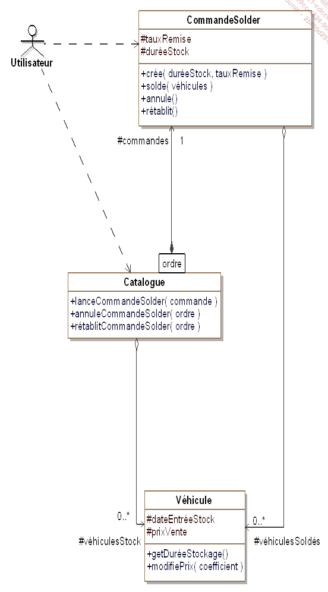
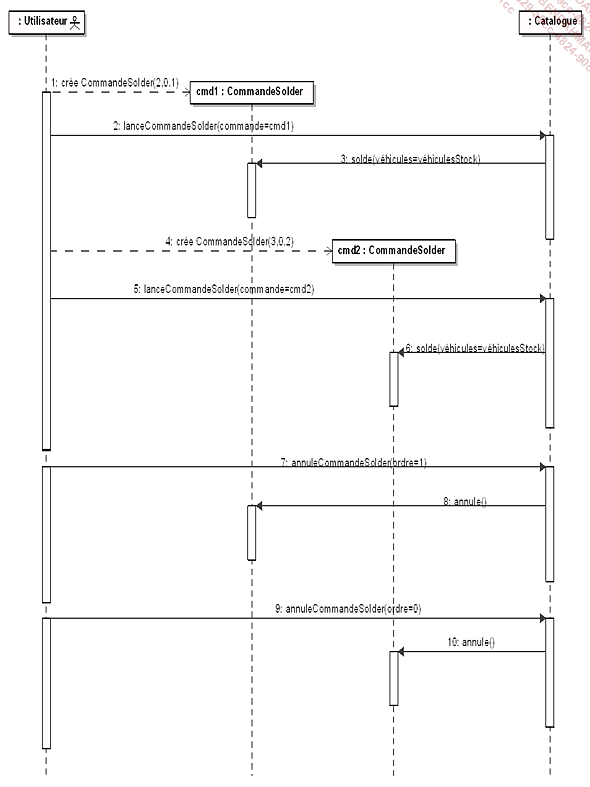

# Contexte

Dans certains cas, la gestion d’une commande peut être assez complexe : elle peut être annulable, mise dans une file d’attente ou être tracée. Dans le cadre du système de vente de véhicules, le gestionnaire peut demander au catalogue de solder les véhicules d’occasion présents dans le stock depuis une certaine durée. Pour des raisons de facilité, cette demande doit pouvoir être annulée puis, éventuellement, rétablie.

Pour gérer cette annulation, une première solution consiste à indiquer au niveau de chaque véhicule s’il est ou non soldé. Cette solution n’est pas suffisante car un même véhicule peut être soldé plusieurs fois avec des taux différents. Une autre solution serait alors de conserver son prix avant la dernière remise, mais cette solution n’est pas non plus satisfaisante car l’annulation peut porter sur une autre requête de remise que la dernière.

Le pattern Command résout ce problème en transformant la requête en un objet dont les attributs vont contenir les paramètres ainsi que l’ensemble des objets sur lesquels la requête a été appliquée. Dans notre exemple, il devient ainsi possible d’annuler ou de rétablir une requête de remise.

