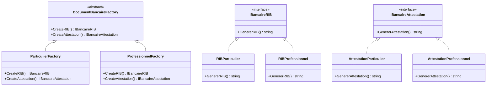

# ESI4D - Entrainement Examen 01 - corrigé

1. Diagramme de Classes :

- La fabrique abstraite `DocumentBancaireFactory` définit l'interface pour créer les deux types de documents
- Deux fabriques concrètes : `ParticulierFactory` et `ProfessionnelFactory`
- Deux interfaces de produits : `IBancaireRIB` et `IBancaireAttestation`
- Quatre classes concrètes de produits pour les différentes versions des documents

1. Implémentation C# :

- Les interfaces définissent les méthodes que chaque type de document doit implémenter
- Chaque produit concret implémente son interface correspondante
- Les fabriques concrètes créent les produits appropriés selon le type de client
- La méthode Main démontre l'utilisation avec les deux types de clients

1. Pour ajouter un nouveau type de document (question 4) :
2. Créer une nouvelle interface (par exemple `IBancaireFiscal`)
3. Ajouter la méthode de création dans `DocumentBancaireFactory`
4. Implémenter les versions particulier et professionnel
5. Ajouter la création dans chaque fabrique concrète

Les avantages de cette solution :

- Encapsulation de la création des documents
- Cohérence garantie entre les documents d'une même famille
- Extensibilité facilitée
- Respect du principe Open/Closed car l'ajout de nouveaux types ne modifie pas le code existant

Cette implémentation permet de :

- Créer des familles de documents cohérentes
- Isoler le code client des implémentations concrètes
- Faciliter l'ajout de nouveaux types de documents
- Maintenir la consistance entre les produits associés

